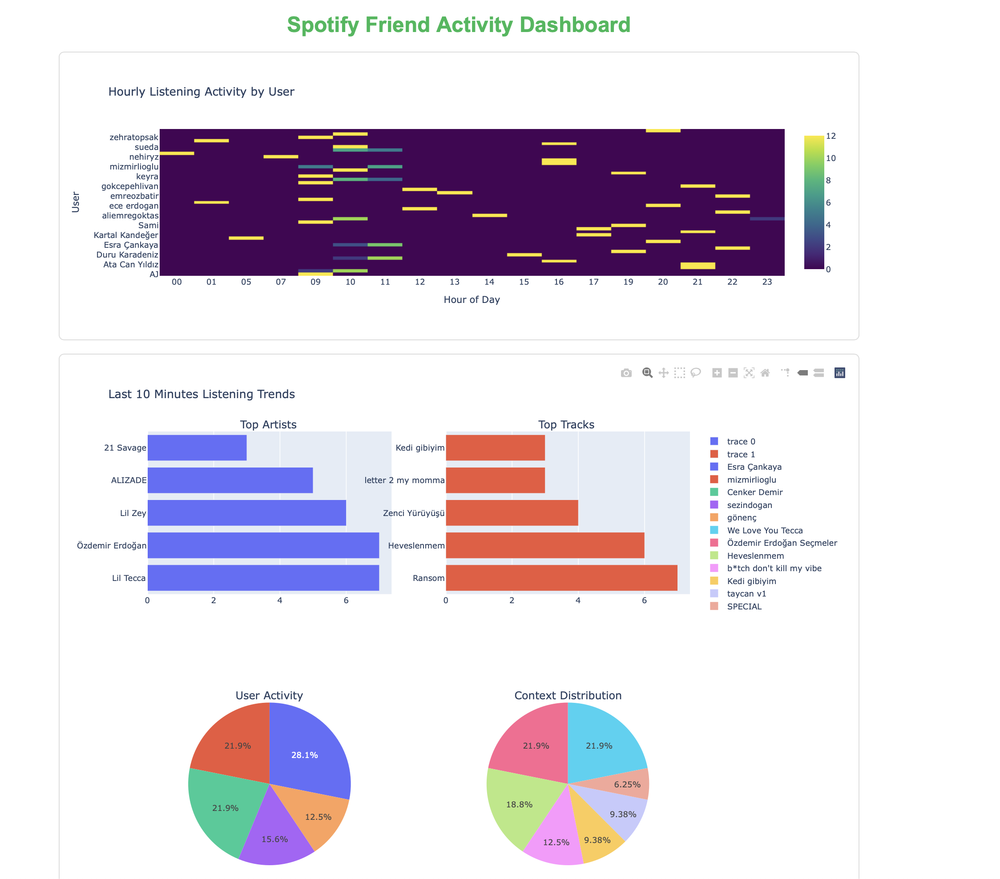

<<<<<<< HEAD
# it should use only for test
=======
# Spotify Friend Activity Analyzer

A real-time dashboard that tracks and visualizes your Spotify friends' listening activities. This project collects data about what your friends are listening to on Spotify, stores it in a database, and presents it through an interactive dashboard with various visualizations.

## Features

- 🎵 **Real-time Activity Tracking**: Monitor your friends' Spotify listening activity as it happens
- 📊 **Interactive Dashboard**: View listening patterns through dynamic visualizations
- 👥 **User-specific Analytics**: Analyze individual user's listening habits
- 📈 **Activity Heatmaps**: Visualize listening patterns by hour of day
- 🎨 **Trend Analysis**: Track top artists, tracks, and listening contexts
- 🔄 **Automatic Updates**: Dashboard refreshes automatically to show the latest data
>>>>>>> 02f5934d20f89fde09a3d6ca42fa9a01a1d29c84
